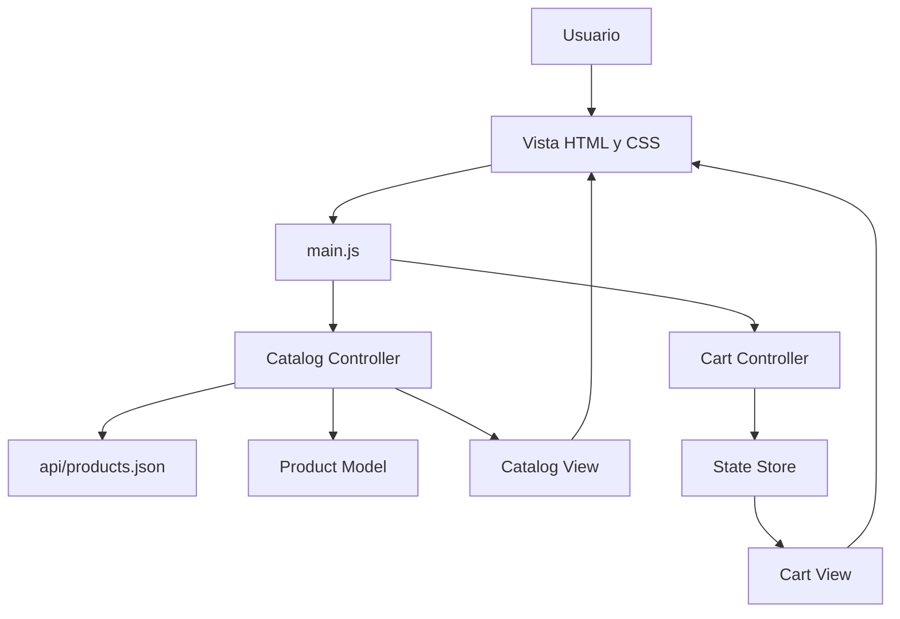

# SneakerDrop: Arquitectura basada en MVC

Aplicación web de catálogo de zapatillas construida para practicar la arquitectura **Modelo-Vista-Controlador (MVC)** con JavaScript moderno. El usuario puede consultar productos cargados desde un archivo JSON, agregarlos al carrito, quitarlos y ver cómo se actualizan la cantidad y el total.

## ¿Qué aprendimos?

- Separar una aplicación en responsabilidades claras: **modelo**, **vista**, **controlador** y **estado**.
- Usar módulos ES (`import` y `export`) para organizar el código y reducir el acoplamiento.
- Cargar datos de manera asíncrona con `fetch` y transformar la respuesta en instancias del modelo `Product`.
- Mantener el estado del carrito en un único lugar mediante `getState`, `dispatch` y `subscribe`.
- Actualizar la interfaz a partir de cambios de estado, en lugar de modificar cada elemento del DOM desde cualquier parte de la aplicación.
- Delegar eventos con `data-*` para identificar productos y acciones sin registrar un listener por cada botón.
- Separar la generación del HTML de la lógica que decide cuándo debe renderizarse.
- Manejar errores de carga del catálogo y mostrar un estado alternativo al usuario.
- Formatear precios para la configuración regional argentina (`es-AR`).
- Escribir pruebas automatizadas con Vitest para verificar el comportamiento del carrito.
- Construir una interfaz responsive con HTML semántico, CSS, estados de accesibilidad y un drawer para el carrito.

## Arquitectura del proyecto



### Modelo

La carpeta `models/` contiene `Product`, que representa un producto del catálogo y define sus datos principales: identificador, nombre, precio, imagen y stock.

El archivo `api/products.json` funciona como fuente de datos local. En una aplicación real podría reemplazarse por una API HTTP sin cambiar la responsabilidad del modelo ni la vista.

### Vistas

Las vistas de `views/` son funciones puras que reciben datos y devuelven una representación HTML:

- `catalog-view.js` genera las tarjetas de productos y el mensaje de error del catálogo.
- `cart-view.js` genera las filas del carrito, el contador y el total.

Estas funciones no buscan elementos del DOM ni deciden cuándo se ejecutan; solo transforman datos en HTML.

### Controladores

Los controladores de `controllers/` coordinan las acciones de la aplicación:

- `catalog-controller.js` carga el JSON, crea instancias de `Product`, conserva los productos disponibles y permite buscarlos por ID.
- `cart-controller.js` recibe las interacciones del usuario y las convierte en acciones para el store. También se suscribe a los cambios para volver a renderizar el carrito.

### Estado

`state/store.js` centraliza el carrito:

- `dispatch(action)` modifica el estado según el tipo de acción.
- `getState()` devuelve el estado actual.
- `subscribe(callback)` permite reaccionar a cada actualización y devuelve una función para cancelar la suscripción.
- `ADD_TO_CART` agrega un producto.
- `REMOVE_FROM_CART` elimina los productos que coinciden con un ID.

Este patrón evita que varias partes de la interfaz mantengan copias distintas del carrito.

### Punto de entrada

`main.js` conecta todas las piezas de la aplicación. Selecciona los elementos del DOM, crea los controladores, define las funciones de renderizado y registra los eventos para:

- cargar el catálogo al iniciar;
- agregar productos al carrito;
- quitar productos;
- abrir y cerrar el drawer;
- actualizar contador, contenido y total;
- mostrar una notificación cuando se agrega un producto.

## Flujo principal

1. `main.js` crea los controladores y solicita la carga del catálogo.
2. `catalog-controller.js` obtiene `api/products.json` mediante `fetch`.
3. Cada registro se transforma en un objeto `Product`.
4. `catalog-view.js` genera las tarjetas y `main.js` las inserta en `.products`.
5. Al pulsar **Agregar**, el controlador localiza el producto por ID y despacha `ADD_TO_CART`.
6. El store actualiza el estado y notifica a sus suscriptores.
7. `cart-view.js` recalcula las filas, la cantidad y el total.
8. `main.js` actualiza el drawer del carrito.

## Estructura

```text
.
├── api/
│   └── products.json              # Datos locales del catálogo
├── controllers/
│   ├── cart-controller.js         # Acciones y coordinación del carrito
│   └── catalog-controller.js      # Carga y búsqueda de productos
├── css/
│   └── styles.css                 # Diseño, responsive y estados visuales
├── models/
│   └── product.js                 # Entidad Product
├── state/
│   └── store.js                   # Estado global y suscripciones
├── tests/
│   └── cart-controller.test.js    # Prueba del agregado y total del carrito
├── views/
│   ├── cart-view.js               # Render del carrito
│   └── catalog-view.js            # Render del catálogo
├── index.html                     # Estructura semántica de la página
├── main.js                        # Composición y eventos del frontend
├── package.json                   # Scripts y dependencias
└── package-lock.json              # Versiones instaladas
```

## Tecnologías

- HTML5
- CSS3, variables personalizadas y media queries
- JavaScript ES Modules
- Node.js y npm
- Vitest
- Google Fonts: Barlow Condensed y Space Grotesk

## Cómo ejecutar el proyecto

1. Instalar las dependencias:

   ```bash
   npm install
   ```

2. Ejecutar las pruebas:

   ```bash
   npm test
   ```

3. Servir el proyecto con un servidor local para que `fetch` pueda leer el JSON. Por ejemplo, desde VS Code se puede usar una extensión como Live Server. Luego abrir `index.html` desde esa URL local.

## Pruebas

La prueba disponible verifica que:

- un producto pueda agregarse mediante `cartController.addProductToCart`;
- el store conserve el producto;
- la vista calculada muestre el total formateado como `$89.999`.

## Próximos pasos posibles

- Validar el stock antes de agregar productos.
- Evitar duplicados o incorporar cantidades por producto.
- Persistir el carrito en `localStorage`.
- Implementar el checkout y el envío del formulario de contacto.
- Agregar pruebas para quitar productos, cargar el catálogo y manejar errores.
- Extraer el formateo de precios a una utilidad compartida.
- Sustituir los placeholders de imágenes por recursos reales.

## Idea central

MVC permite que cada parte tenga una responsabilidad concreta: el modelo representa los datos, la vista los muestra, el controlador coordina las acciones y el store conserva el estado. Esta separación hace que el proyecto sea más fácil de entender, probar y extender.
